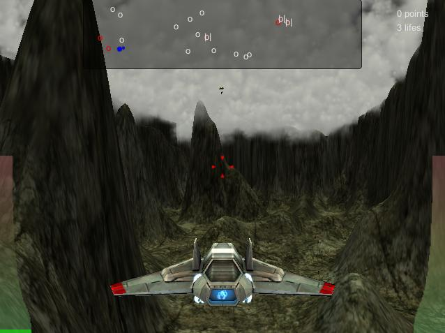

# defender3d

A 3D remake of the scrolling arcade shooter "Defender" from 1980.

__THIS PROJECT IS NOT MAINTAINED ANYMORE.__

The project website can be found [here](https://mgoltzsche.github.io/defender3d/).

## Background

The project was implemented as part of the "Game Engine Architecture" course of the computer science and media master's program at [Berliner Hochschule für Technik](https://www.bht-berlin.de/) (formerly Beuth University of Applied Sciences) during the winter semester 2012/2013.
The course was held by Prof. Dr. Henrik Tramberend.

## About the game

In the original scrolling shooter "Defender" the player controls a spaceship that flies across a planet in order to protect the colonists that are moving on the planet's surface underneath and prevent them from being abducted by alien spaceships that are coming from above.
When an alien spaceship manages to abduct a colonist and bring her to the upper end of the playing field, the latter comes back as a mutant, kamikaze-attacking the player's spaceship.
The goal of the game is to protect the colonists by shooting the alien spaceships and, in case aliens manage to abduct a colonist, to shoot them and catch the abducted colonist before it falls on the planet's surface and dies.
The game is won when the player destroyed all alien spaceships and mutants.
It is lost when the player has no more lifes left.

## Modern remake

As part of the university course the game was rebuild in 3D using the [Unity game engine](https://unity.com/) and C#.
While the new version of the game only contains a single level and 3 types of enemies, it adds two multi-player game modes that didn't exist in the original: coop and deathmatch.

## Development team

* [Max Goltzsche](https://github.com/mgoltzsche)
* [Dennis Fietz](https://github.com/Fietz)

